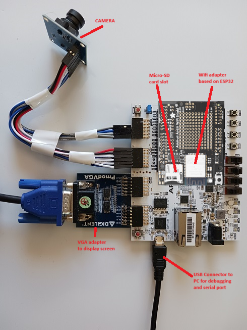

# Introduction

Ztachip is a Multicore, Data-Aware, Embedded RISC-V AI Accelerator for Edge Inferencing running on low-end FPGA devices or custom ASIC.

Acceleration provided by ztachip can be up to 20-50x compared with a non-accelerated RISCV implementation
on many vision/AI tasks. ztachip performs also better when compared with a RISCV that is equipped with vector extension.

An innovative tensor processor hardware is implemented to accelerate a wide range of different tasks from
many common vision tasks such as edge-detection, optical-flow, motion-detection, color-conversion
to executing TensorFlow AI models. This is one key difference of ztachip when compared with other accelerators
that tend to accelerate only a narrow range of applications only (for example convolution neural network only).

A new tensor programming paradigm is introduced to allow programmers to leverage the massive processing/data parallelism enabled by ztachip tensor processor.


# Features
## Hardware
Ztachip consists of the following functional units tied via an AXI Bus to a VexRicsv CPU, a DRAM and other
peripherals as follows
1. The Mcore, a Scheduling Processor
2. A Dataplane, to stream the next data and instruction to the Tensor Engine .
3. A Scratch-Pad Memory to temporarily hold data
4. A Stream Processor to manage data IO
5. Tensor Engine with 28x Pcores that can be configured to act like a systolic array to perform in memory compute each containing a Scalar and Vector ALU, with 16 Threads of execution on private memory.

## Software
The software provided consists of 
1. Ztachip DSL C-like compiler
2. AI vision libraries
3. Application examples
4. Micropython port and examples

## Demo

[](https://www.youtube.com/watch?v=nLGmmw7-PYs)

# Documentation

1. [Technical overview](Documentation/Overview.md)

2. [Hardware Architecture](Documentation/HardwareDesign.md)

3. [Programmers Guide](https://github.com/ztachip/ztachip/raw/master/Documentation/ztachip_programmer_guide.pdf)

4. [VisionAI Stack Programmers Guide](https://github.com/ztachip/ztachip/raw/master/Documentation/visionai_programmer_guide.pdf)

5. [MicroPython Programmers Guide](micropython/MicropythonUserGuide.md)

# Code structure

```
.
├── Documentation         Overview on HW/SW and programmer's guide for ztachip, pcore, visionai and tensor
├── HW                    Hardware
│   ├── examples          Reference Design: Integration of Vexriscv, Ztachip, DDR3, VGA, Camera, LEDs & Buttons
│   ├── platform          Memory IP depenedencies for different FPGA synthesis (e.g. XIlinx, Altera) or ASIC
│   ├── simulation        RTL Simulation
│   └── src               RTL of Ztachip's top design, Scalar/Vector ALU, Dataplane, Pcore, SoC integration etc
├── LICENSE.md
├── micropython           Micropython Support
│   ├── examples          edge_detection, image_classification, motion_detect, object_detect, point_of_interest etc
│   ├── micropython       micropython
│   └── ztachip_port      ztachip micropython port
├── README.md
├── SW                    Software
│   ├── apps              AI kernel libraries of canny edge detector, harris corner, neural nets, optical flow etc
│   ├── base              C runtime zero, Ztachip application libraries and other utilities
│   ├── compiler          Ztachip C-like DSL compiler that generates instructions for the tensor processor
│   ├── fs                File for data inference to be downloaded together with the build image
│   ├── linker.ld         linker script for Ztachip
│   ├── makefile          Main project makefile
│   ├── makefile.kernels  Kernel makefile
│   ├── makefile.sim      Makefile to test Kernels
│   ├── sim               C source to test kernels
│   └── src               SW Main (visionai and unit test entry points), SoC drivers and Zta's micropython API
│                         This is a good place to learn on how to use ztachip prebuilt vision and AI stack.
└── tools                 openocd and vexriscv interface descriptions
```

In `HW/platform`, a generic implementation is also provided for simulation environment. Any FPGA/ASIC can be supported with the appropriate implementation of this wrapper layer. Choose the appropriate sub-folder that corresponds to your FPGA target.

Also, in `SW/apps`, many prebuilt acceleration functions are provided to provide programmers with a fast path to leverage ztachip acceleration. This folder is also a good place to learn on how to program your own custom acceleration functions.

# SW build procedure

There are several demos available which demonstrate various capabilities of ztchip.
Choose to build one of the 3 demos described below.

## Prerequisites (Ubuntu)

```
sudo apt-get install autoconf automake autotools-dev curl python3 libmpc-dev libmpfr-dev libgmp-dev gawk build-essential bison flex texinfo gperf libtool patchutils bc zlib1g-dev libexpat-dev python3-pip
pip3 install numpy
```

## Download and build RISCV tool chain

The build below is a pretty long.

```
export PATH=/opt/riscv/bin:$PATH
git clone https://github.com/riscv/riscv-gnu-toolchain
cd riscv-gnu-toolchain
./configure --prefix=/opt/riscv --with-arch=rv32im --with-abi=ilp32
sudo make
```

## Download ztachip
```
git clone https://github.com/ztachip/ztachip.git
```

## Build procedure for demo #1 - AI+Vision
This demo demonstrates many vision and AI capabilities using a native [C/C++ library interface](https://github.com/ztachip/ztachip/raw/master/Documentation/visionai_programmer_guide.pdf)

This demo is shown in this [video](https://www.youtube.com/watch?v=amubm828YGs)

```
export PATH=/opt/riscv/bin:$PATH
cd ztachip
cd SW/compiler
make clean all
cd ../fs
python3 bin2c.py
cd ..
make clean all -f makefile.kernels
make clean all
```

## Build procedure for demo #2 - AI+Vision+Micropython
This example is similar to example 1 except that the program is using a [Python programming interface](micropython/MicropythonUserGuide.md)

This demo is shown in this [video](https://www.youtube.com/watch?v=nLGmmw7-PYs)

You are required to complete first the build procedure for demo #1 above.
Then follow with a micropython build below.

```
git clone https://github.com/micropython/micropython.git
cd micropython/ports
cp -avr <ztachip installation folder>/micropython/ztachip_port .
cd ztachip_port
export PATH=/opt/riscv/bin:$PATH
export ZTACHIP=<ztachip installation folder>
make clean
make
```

## Build procedure for demo #3 - LLM chatbot 
This demo demonstrates a LLM chatbot running SmolLM2 model. SmolLM2 is based LLAMA architecture but trained by HuggingFace team.

Update the following variable in SW/makefile
```
LLM_TEST=yes
```
Then proceed with similar build procedure of demo #1.

### Quantizing LLM model required by demo #3

Demo #3 requires a quantized LLM model to be prepared. Follow the steps below.

- Download SmolLM2-135M-Instruct from HuggingFace

```
git clone git@hf.co:HuggingFaceTB/SmolLM2-135M-Instruct
```

- Install [llama.cpp](https://github.com/ggml-org/llama.cpp)

- From llama.cpp installation, convert the downloaded model to GGUF format (FP32). GGUF format is the LLM format used by the popular Ollama inferencing engine.

```
cd <llama_cpp-install-folder>
python convert_hf_to_gguf.py <model-download-folder>/SmolLM2-135M-Instruct --outfile SmolLM2-135M-Instruct.gguf --outtype f32
```

- Quantize the model to ztachip ZUF format.

```
export PATH=/opt/riscv/bin:$PATH
cd ztachip/SW
make clean all -f makefile.quant
./build/quant ZTA Q4 SmolLM2-135M-Instruct.gguf SMOLLM2.ZUF
```

- SMOLLM2.ZUF will be transfered from PC to FPGA board over Ethernet. A TFTP server is required to run on a PC that is connecting to the ArtyBoard by Ethernet.
PC Ethernet interface is expected to be configured with an ip address=10.10.10.10 

# FPGA build procedure

- Download Xilinx Vivado Webpack free edition.

- Create the project file, build FPGA image and program it to flash as described in
[FPGA build procedure](Documentation/Vivado.md)

# Running the demos.

The following demos are demonstrated on the [ArtyA7-100T FPGA development board](https://digilent.com/shop/arty-a7-artix-7-fpga-development-board/).

- Image classification with TensorFlow's Mobinet

- Object detection with TensorFlow's SSD-Mobinet

- Edge detection using Canny algorithm

- Point-of-interest using Harris-Corner algorithm

- Motion detection

- Multi-tasking with ObjectDetection, edge detection, Harris-Corner, Motion Detection running at
same time

To run the demo, press button0 to switch between different AI/vision applications.

## Preparing hardware

Reference design example required the hardware components below... 

- [Arty A7-100T development board](https://digilent.com/shop/arty-a7-artix-7-fpga-development-board/)

- [VGA module](https://digilent.com/shop/pmod-vga-video-graphics-array/)

- [Camera module](https://www.amazon.ca/640X480-Interface-Exposure-Control-Display/dp/B07PX4N3YS/ref=sr_1_2_sspa?gclid=EAIaIQobChMIttra8bjo-QIVCMqzCh27tA5XEAAYASAAEgKJTPD_BwE&hvadid=596026577980&hvdev=c&hvlocphy=9000555&hvnetw=g&hvqmt=e&hvrand=6338354247560979516&hvtargid=kwd-296249713094&hydadcr=13589_13421122&keywords=ov7670+camera+module&qid=1661652319&sr=8-2-spons&psc=1&spLa=ZW5jcnlwdGVkUXVhbGlmaWVyPUEzVDhCRUlYWEJZUU8xJmVuY3J5cHRlZElkPUEwMDExNDE5M1ZRSEw3WDdEWk9VWiZlbmNyeXB0ZWRBZElkPUEwMTgwOTYwWTFXWUNPWE8xQzk2JndpZGdldE5hbWU9c3BfYXRmJmFjdGlvbj1jbGlja1JlZGlyZWN0JmRvTm90TG9nQ2xpY2s9dHJ1ZQ==)

Attach the VGA and Camera modules to Arty-A7 board according to picture below 



Connect camera_module to Arty board according to picture below


## Open serial port

If you are running ztachip's micropython image, then you need to connect to the serial port. Arty-A7 provides serial port connectivity via USB. Serial port flow control must be disabled.

```
sudo minicom -w -D /dev/ttyUSB1
```

Note: After the first time connecting to serial port, reset the board again (press button next to USB port and wait for led to turn green) since USB serial must be the first device to connect to USB before ztachip.

## Download and build OpenOCD package required for GDB debugger's JTAG connectivity

In this example, we will load the program using GDB debugger and JTAG

```
sudo apt-get install libtool automake libusb-1.0.0-dev texinfo libusb-dev libyaml-dev pkg-config
git clone https://github.com/SpinalHDL/openocd_riscv
cd openocd_riscv
./bootstrap
./configure --enable-ftdi --enable-dummy
make
cp <ztachip installation folder>/tools/openocd/soc_init.cfg .
cp <ztachip installation folder>/tools/openocd/usb_connect.cfg .
cp <ztachip installation folder>/tools/openocd/xilinx-xc7.cfg .
cp <ztachip installation folder>/tools/openocd/jtagspi.cfg .
cp <ztachip installation folder>/tools/openocd/cpu0.yaml .
```

## Launch OpenOCD

Make sure the green led below the reset button (near USB connector) is on. This indicates that FPGA has been loaded correctly.
Then launch OpenOCD to provide JTAG connectivity for GDB debugger

```
cd <openocd_riscv installation folder>
sudo src/openocd -f usb_connect.cfg -c 'set MURAX_CPU0_YAML cpu0.yaml' -f soc_init.cfg
```

## Uploading SW image via GDB debugger

### Upload procedure for demo#1 and demo#3 (without micro-python)
Open another terminal, then issue commands below to upload the standalone image

```
export PATH=/opt/riscv/bin:$PATH
cd <ztachip installation folder>/SW/src
riscv32-unknown-elf-gdb ../build/ztachip.elf
```

### Upload procedure for demo#2 (micro-python)
Open another terminal, then issue commands below to upload the micropython image.

```
export PATH=/opt/riscv/bin:$PATH
cd <Micropython installation folder>/ports/ztachip_port
riscv32-unknown-elf-gdb ./build/firmware.elf
```

### Start the image transfer

From GDB debugger prompt, issue the commands below
This step takes some time since some AI models are also transfered.

```
set pagination off
target remote localhost:3333
set remotetimeout 60
set arch riscv:rv32
monitor reset halt
load
```

## Run the program

After sucessfully loading the program, issue command below at GDB prompt

```
continue
```

### Running demo #1
If you are running demo #1, press button0 to switch between different AI/vision applications. The sample application running is implemented in [vision_ai.cpp](SW/src/vision_ai.cpp)

### Running demo #2
If you are running the micropython image, Micropython allows for entering python code in paste mode at the serial port.  
To use the paste mode, hit Ctrl+E then paste one of the [examples](micropython/examples/) to the serial port, then hit ctrl+D to execute the python code.

Hit any button to return back to Micropython prompt.

### Running demo #3
You will be presented with a prompt on the serial port.
Enter a question then hit enter.
There will be a response from LLM model.
Hit Ctrl-C to break the response.

# How to port ztachip to other FPGA,ASIC and SOC 

Click [here](Documentation/PortProcedure.md) for procedure on how to port ztachip and its applications to other FPGA/ASIC and SOC.

# Run ztachip in simulation

First build example test program for simulation.
The example test program is under SW/apps/test and SW/sim

```
export PATH=/opt/riscv/bin:$PATH
cd ztachip
cd SW/compiler
make clean all
cd ..
make clean all -f makefile.kernels
make clean all -f makefile.sim
```

Copy the generated image <ztachip>/SW/build/ztachip_sim.hex to folder where you run your simulator. 

This image will be loaded to the simulated memory.

Then compile all RTL codes below for simulation
```
HW/src
HW/platform/simulation
HW/simulation
HW/riscv/sim
```
The top component of your simulation is HW/simulation/main.vhd

Provide clock to main:clk

main:led_out should blink everytime a test result is passed.


# Contact

This project is free to use. You can open an issue or a discussion on github.
But for business consulting and support, please
 <a href="mailto:vuongdnguyen@hotmail.com?cc=&subject=Ztachip Support&body=Hi Vuong \n">contact us</a></p>
Follow ztachip on [Twitter](https://twitter.com/ztachip)

